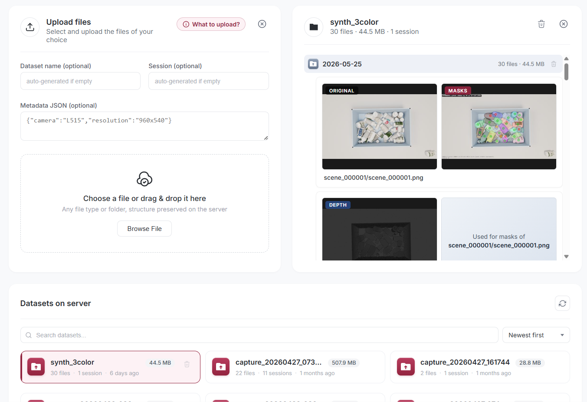
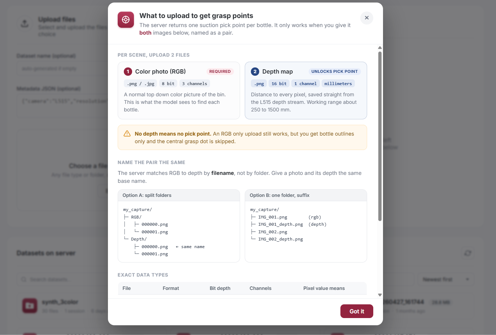

# pharma-bin-picking-dropbox

A drop-zone API and web UI for collecting **Intel RealSense L515 RGB-D captures** and datasets from the capture team, feeding the **UOAIS pharmaceutical bin-picking pipeline** on the GPU server.

Built with [FastAPI](https://fastapi.tiangolo.com/). Accepts any file type, organized by `dataset / session / file`.

---

## Screenshots

**Web UI.** Drag and drop upload, live mask and depth previews, and a searchable dataset browser:



**"What to upload?" popup.** Opens automatically after login, showing the RGB and depth files and naming rule needed to get grasp points:



---

## Features

- **Drag-and-drop web UI** at `/` for non-technical users
- **REST API** for scripted uploads from the capture rig
- **Auto-organized storage**: `storage/<dataset>/<session>/<file>`
  - `session` defaults to a UTC timestamp if not provided
  - filename collisions are auto-suffixed (`foo.png` → `foo_1.png`)
- **Optional JSON metadata** per upload (camera params, notes, etc.)
- **Browse / download / delete** endpoints for managing stored captures
- **Health endpoint** with disk-free reporting

---

## Quick start

```bash
# 1. Clone
git clone https://github.com/rotanakkosal/pharma-bin-picking-dropbox.git
cd pharma-bin-picking-dropbox

# 2. Set up venv
python3 -m venv .venv
source .venv/bin/activate
pip install -r requirements.txt

# 3. Run the server
uvicorn main:app --host 0.0.0.0 --port 8000
```

Then open:

- **Web UI:** http://localhost:8000/
- **Interactive API docs:** http://localhost:8000/docs
- **Health check:** http://localhost:8000/health

---

## API overview

| Method | Path                                            | Purpose                                          |
| ------ | ----------------------------------------------- | ------------------------------------------------ |
| GET    | `/`                                             | Drag-and-drop web UI                             |
| POST   | `/upload/{dataset}`                             | Upload one or more files to a dataset/session   |
| GET    | `/datasets`                                     | List all datasets                                |
| GET    | `/datasets/{dataset}`                           | Show a dataset and its sessions                  |
| GET    | `/datasets/{dataset}/{session}`                 | List files in a session                          |
| GET    | `/datasets/{dataset}/{session}/{filename}`      | Download a specific file                         |
| DELETE | `/datasets/{dataset}?confirm=true`              | Delete an entire dataset                         |
| DELETE | `/datasets/{dataset}/{session}?confirm=true`    | Delete a single session                          |
| GET    | `/health`                                       | Server health and disk usage                     |

### Example: upload from `curl`

```bash
curl -X POST http://<server>:8000/upload/bottle_v1 \
  -F "session=morning_run" \
  -F "files=@rgb_001.png" \
  -F "files=@depth_001.png" \
  -F 'metadata={"camera":"L515","exposure_ms":33}'
```

### Example: upload from Python

```python
import requests

files = [
    ("files", open("rgb_001.png", "rb")),
    ("files", open("depth_001.png", "rb")),
]
data = {"session": "morning_run", "metadata": '{"camera":"L515"}'}

r = requests.post("http://<server>:8000/upload/bottle_v1", files=files, data=data)
print(r.json())
```

---

## Storage layout

```
storage/
└── <dataset>/
    └── <session>/
        ├── rgb_001.png
        ├── depth_001.png
        └── metadata.json   # auto-merged across uploads
```

The `storage/` directory is git-ignored — captures live on the server, not in the repo.

---

## Project context

This service is the **ingest layer** for a larger pharmaceutical bin-picking project:

1. **Capture team** photographs Korean pharmaceutical bottles with an Intel RealSense L515.
2. Files land here via the drag-and-drop UI or scripted uploads.
3. The GPU server runs **UOAIS (Unseen Object Amodal Instance Segmentation)** to detect bottles and compute suction-cup grasp points.
4. A robot arm executes top-down picks based on the computed centroids.

---

## Requirements

- Python 3.10+
- See [requirements.txt](requirements.txt) — FastAPI, Uvicorn, python-multipart

---

## License

Internal / unreleased.
